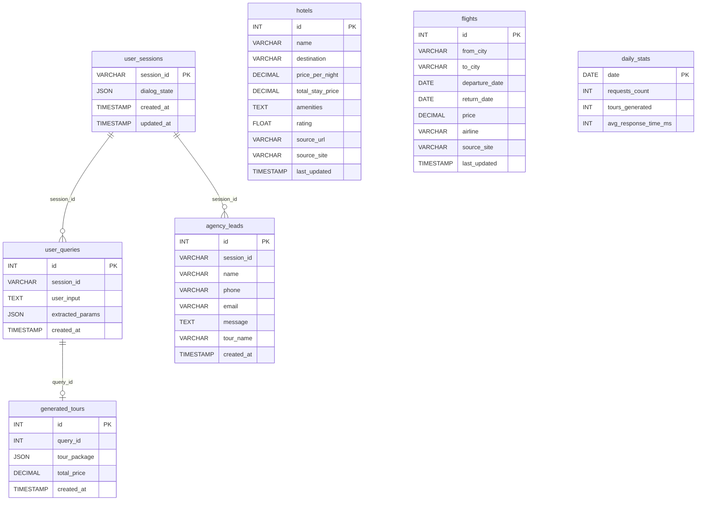

# Схема базы данных MySQL

```mermaid
erDiagram
    user_sessions {
        VARCHAR session_id PK
        JSON dialog_state
        TIMESTAMP created_at
        TIMESTAMP updated_at
    }

    user_queries {
        INT id PK
        VARCHAR session_id
        TEXT user_input
        JSON extracted_params
        TIMESTAMP created_at
    }

    generated_tours {
        INT id PK
        INT query_id
        JSON tour_package
        DECIMAL total_price
        TIMESTAMP created_at
    }

    hotels {
        INT id PK
        VARCHAR name
        VARCHAR destination
        DECIMAL price_per_night
        DECIMAL total_stay_price
        TEXT amenities
        FLOAT rating
        VARCHAR source_url
        VARCHAR source_site
        TIMESTAMP last_updated
    }

    flights {
        INT id PK
        VARCHAR from_city
        VARCHAR to_city
        DATE departure_date
        DATE return_date
        DECIMAL price
        VARCHAR airline
        VARCHAR source_site
        TIMESTAMP last_updated
    }

    agency_leads {
        INT id PK
        VARCHAR session_id
        VARCHAR name
        VARCHAR phone
        VARCHAR email
        TEXT message
        VARCHAR tour_name
        TIMESTAMP created_at
    }

    daily_stats {
        DATE date PK
        INT requests_count
        INT tours_generated
        INT avg_response_time_ms
    }

    user_sessions ||--o{ user_queries : session_id
    user_queries ||--o| generated_tours : query_id
    user_sessions ||--o{ agency_leads : session_id
```
